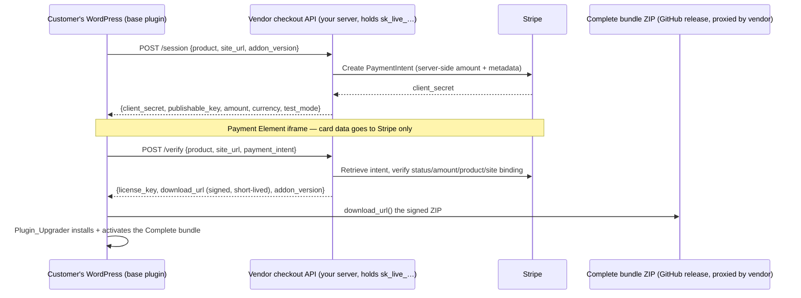

# Commerce Vendor API — Contract

The base plugin (`nvoos-content-graph`) deliberately contains **no Stripe keys
and no Stripe API calls**. Selling the **NV oOS Complete** bundle (the full
NV oOS plugin: base + Pro, distributed as a separate WordPress plugin) works
like this:



- The customer never needs Stripe keys; they simply pay with their card.
- The `sk_…` secret key exists only on the vendor server.
- The `pk_…` publishable key is returned per-session by `/session` (it is
  public by design).
- Because `/verify` returns a **signed, short-lived `download_url`**, the
  payment actually gates the download even though the GitHub repo is public.

## What gets installed

The purchased artifact is `nvdigital-open-operator-system-oos-complete-{version}.zip`
from the monorepo GitHub releases (`release.yml`, built on `v*.*.*` tags).
It extracts to the plugin folder `nvdigital-open-operator-system-oos-complete/`
(main file `nvdigital-open-operator-system-oos.php`) — a **separate plugin**
from this one, never bundled inside the `nvoos-content-graph` package.

Before installing, the plugin refuses when another copy of the NV oOS base
plugin already exists on the site (`mcp-ai-wpoos/`, the wp.org slug, or an
already-active base plugin) — installing a second copy would redeclare the
same constants/classes and break both plugins. In that case the customer is
told to update their existing plugin from the Plugins screen; the purchase
license is still recorded.

## Endpoints

Base URL default: `https://nvdigitalsolutions.com/wp-json/nvoos-checkout/v1`
(override in the plugin via the `nvoos_content_graph/payments/vendor_api_url`
filter, or change `Payments::vendorApiUrl()`).

### POST `/session`

Request JSON:

```json
{
  "product": "nvoos-oos-complete",
  "site_url": "https://customer-site.example",
  "addon_version": "1.1.74"
}
```

Response `200`:

```json
{
  "client_secret": "pi_xxx_secret_yyy",
  "publishable_key": "pk_live_…",
  "amount": 4900,
  "currency": "usd",
  "test_mode": false
}
```

Errors: `402` price mismatch, `424` checkout not configured, `429` rate
limited, `502` Stripe failure. All errors are `{"message": "…"}`.

### POST `/verify`

Request JSON:

```json
{
  "product": "nvoos-oos-complete",
  "site_url": "https://customer-site.example",
  "payment_intent": "pi_…"
}
```

Server-side checks before issuing anything:

1. Retrieve the intent from Stripe with the secret key.
2. `status === 'succeeded'` and `amount_received >= configured price`.
3. `metadata.product` and `metadata.site_url` match the request (the site
   binding set at `/session` time — prevents replaying a payment from
   another site or product).

Response `200`:

```json
{
  "license_key": "hex-or-opaque-key",
  "download_url": "https://your-server.example/download/complete?token=…&expires=…",
  "addon_version": "1.1.74",
  "amount": 4900,
  "currency": "usd"
}
```

The `download_url` serves the Complete bundle ZIP (fetched from the GitHub
release and cached, or proxied) only while the token is valid. Errors mirror
the `/session` codes; `402` means the payment did not complete or the amount
is wrong — the plugin surfaces the message verbatim in the modal.

### Checkout-unavailable fallback

When the plugin cannot reach the vendor `/session` endpoint — network
failure, `404` (route missing), or a server error (`5xx`) — the purchase
modal shows a short notice and redirects the user to the product page so
the purchase can still complete. The target URL defaults to the public
GitHub releases page (`https://github.com/nvdigitalsolutions/mcp-ai-wpoos/releases`)
and is filterable (`nvoos_content_graph/payments/fallback_url`); point it
at the vendor product page, or set an empty value to disable the redirect
and keep the plain in-modal error. Client errors that mean the endpoint IS
available (e.g. `429` session-creation throttling) are shown in the modal
instead of redirecting.

## Reference implementation (host on your server)

The contract above is implemented by the **NV oOS Checkout API** addon in
this repository: [`addons/checkout-api/`](../../../addons/checkout-api/).
Install it on the vendor's own WordPress (e.g. nvdigitalsolutions.com) —
never on customer sites and never on WordPress.org — and configure the
Stripe keys, price, version, and ZIP source on its admin page
(**NV oOS Checkout** in WP-Admin).

What the addon provides:

- `POST /session` + `POST /verify` under `/wp-json/nvoos-checkout/v1/`
  (public, per-IP rate-limited; Stripe-side verification is the gate).
  The `nvoos-oos-complete` product id is accepted alongside the legacy
  `nvoos-content-graph-ai` id.
- License issuance into a custom table, idempotent per payment intent.
- Signed, expiring download URLs of the shape
  `/?nvoos_checkout_download=1&license=…&expires=…&token=…` — the addon
  caches the ZIP per version (from the GitHub release or a private mirror)
  and streams it after verifying the HMAC token.
- A Stripe webhook receiver (`POST /webhooks/stripe`) that revokes licenses
  on `charge.refunded` / `charge.dispute.created`.

### Vendor-side configuration for the Complete bundle

In the checkout addon's admin page set:

1. **Addon version** — the NV oOS release version being sold (e.g. `1.1.74`).
2. **ZIP source** — the Complete bundle release pattern:

   ```
   https://github.com/nvdigitalsolutions/mcp-ai-wpoos/releases/download/v{VERSION}/nvdigital-open-operator-system-oos-complete-{VERSION}.zip
   ```

   (this is the addon's new default; use a private mirror URL or absolute
   server path instead to gate the download behind your own infrastructure).
3. Publish the corresponding `v*.*.*` tag so the release asset exists (the
   addon caches the ZIP under `wp-content/uploads/nvoos-checkout/`).

For the full setup guide (Stripe keys, webhook endpoint configuration,
release publishing) see `addons/checkout-api/README.md`.

## Plugin-side knobs

| Filter | Purpose |
|---|---|
| `nvoos_content_graph/payments/vendor_api_url` | Point at your checkout API |
| `nvoos_content_graph/payments/price_cents` | Display price (vendor sets the authoritative amount) |
| `nvoos_content_graph/payments/addon_version` | Version pinned in payloads + fallback URL (NV oOS release version) |
| `nvoos_content_graph/payments/addon_zip_url` | Fallback ZIP URL when the vendor returns no `download_url` |
| `nvoos_content_graph/payments/fallback_url` | Product-page redirect target when the checkout endpoint is unreachable (default: the GitHub releases page; empty = disabled) |
