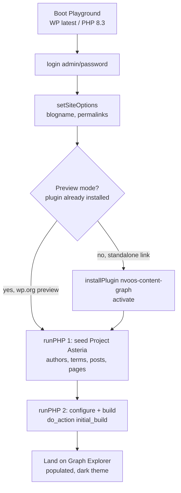

# WordPress Playground Blueprint Plan — "Project Asteria" Demo

A plan for a fun, one-click WordPress Playground blueprint that lets anyone
test-drive **NV oOS Content Graph** with zero setup, plus enabling the
wp.org **Live Preview** button.

## 1. Objective & Success Criteria

**Goal:** Give first-time users a populated, visually stunning knowledge
graph in under ~60 seconds, directly in the browser — no server, no API
keys, no clicking through setup wizards.

Success criteria:

1. A shareable link (`playground.wordpress.net/?blueprint-url=…`) boots a
   WP install with the plugin active, a themed demo content pack, and a
   **fully built graph** — landing on the Graph Explorer.
2. The same experience powers the wp.org plugin page **Preview** button
   (`assets/blueprints/blueprint.json` in SVN).
3. The demo showcases the plugin's headline features organically: search,
   color-by-community, content gap analysis, god-node detection, PNG
   export, and the `[nvoos_graph]` frontend embed.
4. The blueprint is idempotent, works against trunk and stable, and needs
   no externally hosted assets (fully self-contained).

## 2. Research Summary — Industry Standards

Findings from wp.org / Playground documentation and the plugin-author
ecosystem (verified 2026-09):

| Source | Standard / practice adopted |
|---|---|
| [wp.org Previews & Blueprints](https://developer.wordpress.org/plugins/wordpress-org/previews-and-blueprints/) | `blueprint.json` lives in SVN at `assets/blueprints/blueprint.json`; committers get a private "Test Preview" automatically; a **public** preview must be toggled in the plugin's Advanced view. In preview mode the plugin is already installed by Playground. |
| [Blueprint data format](https://developer.wordpress.org/playground/blueprints/data-format/) | Declare `$schema`; use relative `landingPage`; `preferredVersions` only holds `php`/`wp`; `features.networking` for downloads; `activate` goes inside `options`, not `pluginData`; shorthands expand *before* `steps`, so use explicit steps when order matters. |
| [Steps reference](https://developer.wordpress.org/playground/blueprints/steps/) | `login` → `setSiteOptions` → `installPlugin` (with `pluginData` + `options.activate`) → `runPHP` (`<?php require_once '/wordpress/wp-load.php'; …`). `runPHP` is the only step that can call plugin APIs. |
| [DLX tutorial (Ronald Huereca)](https://dlxplugins.com/tutorials/how-to-create-a-wordpress-playground-blueprint-for-your-plugin-live-preview/) | The canonical plugin-demo pattern: login → install theme/plugins → import demo content → `setSiteOptions` (blogname, permalinks, front page) → `runPHP` for serialized/array options; test with `?blueprint-url=` against a GitHub-hosted raw file before committing to SVN. |
| [Joost de Valk](https://joost.blog/plugin-demos-with-the-wordpress-playground/) | Keep the committed blueprint minimal and preview-safe (no self-install); define an `IS_PLAYGROUND_PREVIEW` const so plugin code can detect preview mode. |
| [WooCommerce dev blog](https://developer.woocommerce.com/2025/01/24/demo-your-woo-extension-with-wordpress-playground/) | Use the [Playground Step Library](https://akirk.github.io/playground-step-library/) / Blueprint builder for authoring + the gallery for testing. |
| Plugin source (`src/Plugin.php`, `src/Admin/SettingsPage.php`) | Build is triggerable via the public hook `do_action( 'nvoos_content_graph/initial_build' )`; admin page slug is `nvoos-content-graph`; `auto_rebuild` defaults to `true`; visual theme defaults to `dark`; frontend read access requires a logged-in user or base-plugin guest token. |

Key plugin facts the blueprint leans on:

- Admin explorer page: `/wp-admin/admin.php?page=nvoos-content-graph`
- Public build hook: `nvoos_content_graph/initial_build` (runs a full
  `Builder::build()`; sets a "build complete" transient → dismissible admin
  notice appears on landing)
- Settings option: single grouped `nvoos_content_graph_settings` option
  merged over `Schema::defaultSettings()`
- Frontend embed: `[nvoos_graph]` shortcode on any page

## 3. Demo Concept — "Project Asteria"

A fictional sci-fi universe. A knowledge graph only looks fun when content
is *densely interconnected*, so the content pack is engineered for the
graph, not just for reading:

| Element | Count | Purpose in the graph |
|---|---|---|
| Authors (in-universe voices: Ilsa Venn, Oma Desh, Jax Merrow, "The Editor") | 4 | `user:*` nodes + `authored_by` edges |
| Categories (Factions, Planets, Characters, Technology, Timeline) | 5 | Big community-anchor term nodes |
| Tags (trade-routes, ai, politics, salvage, war, science, culture, crime, exploration, lore) | 10 | Cross-cutting edges → Louvain communities |
| Posts (planets, characters, ships, tech, timeline events) | 26 | The node backbone; every post links 3–6 others via internal `<a>` links |
| Pages (Home with `[nvoos_graph]`, "The Asteria Codex", About the Demo) | 5 | Frontend demo surface + a deliberate **god node** |
| **True orphan posts** (author 0, no terms, no links — degree-0 nodes) | 3 | Make Content Gap Analysis return real isolated-node findings |

Expected result (measured 2026-09-18 on WP 7.1.1 / PHP 8.3): **49 nodes,
255 edges, 5 communities** — dense enough to look great at a glance, small
enough to render instantly and build in seconds.

**Engineered "wow" moments:**

1. **The Codex** — a hub page linking to every post → wins the God Nodes
   tool; visually a bright hub in the center.
2. **Orphan trio** — "Dossier: The Silent Moon", "Field Notes: Rim-Side
   Cantinas", "Signal Intercept 77-B" are *true* degree-0 nodes (author 0,
   term relationships stripped, no links) → Content Gap Analysis lists them
   as isolated nodes, and they float alone at the edge of the layout. The
   Codex's intro hints at "three files remain unindexed" — an Easter egg
   that doubles as a feature demo.
3. **Community coloring** — faction-heavy tags make color-by-community
   immediately legible (faction clusters emerge).
4. **Dark theme** — already the plugin default; no settings step needed.

## 4. Blueprint Design

### 4.1 Step flow



### 4.2 `blueprint.json` — preview-safe version (canonical, committed to SVN)

```json
{
    "$schema": "https://playground.wordpress.net/blueprint-schema.json",
    "landingPage": "/wp-admin/admin.php?page=nvoos-content-graph",
    "preferredVersions": {
        "php": "8.3",
        "wp": "latest"
    },
    "phpExtensionBundles": ["kitchen-sink"],
    "features": {
        "networking": true
    },
    "steps": [
        {
            "step": "login",
            "username": "admin",
            "password": "password"
        },
        {
            "step": "setSiteOptions",
            "options": {
                "blogname": "Project Asteria \u2014 Content Graph Demo",
                "blogdescription": "A fictional universe, mapped as a knowledge graph by NV oOS Content Graph.",
                "permalink_structure": "/%postname%/"
            }
        },
        {
            "step": "runPHP",
            "code": "<?php require_once '/wordpress/wp-load.php'; nvoos_cg_demo_seed(); function nvoos_cg_demo_seed() { if ( get_option( 'nvoos_cg_demo_seeded' ) ) { return; } update_option( 'nvoos_content_graph_settings', array( 'auto_rebuild' => 0 ) ); /* authors, terms, posts, pages — see 4.4 */ update_option( 'nvoos_cg_demo_seeded', 1 ); }"
        },
        {
            "step": "runPHP",
            "code": "<?php require_once '/wordpress/wp-load.php'; $s = get_option( 'nvoos_content_graph_settings', array() ); $s['auto_rebuild'] = 1; update_option( 'nvoos_content_graph_settings', $s ); $home = get_page_by_path( 'asteria' ); if ( $home ) { update_option( 'show_on_front', 'page' ); update_option( 'page_on_front', $home->ID ); } do_action( 'nvoos_content_graph/initial_build' );"
        }
    ]
}
```

Notes:

- The seed step sets `auto_rebuild = 0` **before** inserting posts so the
  per-post incremental rebuild doesn't fire ~35 times; one full build at
  the end is faster and deterministic. The second step flips it back on so
  visitors can watch live graph updates when they edit a post.
- `nvoos_cg_demo_seeded` option guard makes every step idempotent.
- The build hook is fired directly rather than relying on the activation
  one-shot cron (`wp_schedule_single_event( time() + 10, … )`), which is
  non-deterministic in the browser runtime. If that cron *also* fires
  later, it's a harmless idempotent full rebuild.

### 4.3 `demo.json` — standalone variant (shareable links)

Identical to 4.2 with one extra first step (this is the file linked from
README badges / social posts):

```json
{
    "step": "installPlugin",
    "pluginData": {
        "resource": "wordpress.org/plugins",
        "slug": "nvoos-content-graph"
    },
    "options": {
        "activate": true
    }
}
```

- **Why two files:** in wp.org Preview mode the plugin is pre-installed by
  Playground; installing it again from the blueprint is at best redundant
  and at worst replaces the trunk build being previewed. The canonical
  committed file stays preview-safe; the standalone file owns installation.
- **Verify before merging:** `installPlugin` supports an
  `ifAlreadyInstalled` option. If testing on playground.wordpress.net shows
  `ifAlreadyInstalled: "skip"` cleanly no-ops when the plugin is present,
  the two files can collapse into one. Test with both the standalone URL
  and the committer-only Test Preview button.

### 4.4 Content seeding function (implemented)

Array-driven PHP in `blueprints/seed-content.php`, embedded verbatim into
the `runPHP` step by the generator. Bodies are written as natural prose with
`{{slug}}` tokens inline; a renderer swaps each token for a relative
`<a href="/{slug}/">Title</a>` link (relative hrefs are resolved against
`home_url()` at build time — no instance URLs baked in):

```php
$posts = array(
    array(
        'title'   => 'The Sundering of Kythera Prime',
        'slug'    => 'sundering-kythera',
        'cat'     => 'timeline',
        'tags'    => array( 'war', 'politics' ),
        'author'  => 'oma-desh',
        'excerpt' => 'A tariff dispute that ended with the orbital ring in pieces.',
        'body'    => array(
            "The Sundering of Kythera Prime began with a tariff dispute and ended with the orbital ring of {{kythera-prime}} in pieces.",
            "The {{vanguard-concord}} calls it a defensive action; the {{rust-nebula-outriders}} call it a career opportunity.",
        ),
    ),
    // … 26 posts total. Orphans: 'author' => 0, 'orphan' => true, no tokens.
    // … pages: 'asteria' (Home, [nvoos_graph] shortcode, raw HTML),
    //     'the-codex' (link list of every entry — the god node),
    //     'sector-map', 'field-manual', 'about-the-demo'.
);
```

Implementation details that matter:

- **Tokens are guaranteed-valid links** — every token maps to a real slug
  in the same dataset, so every `<a href>` resolves and becomes a
  `LINKS_TO` edge.
- **Orphans are true degree-0 nodes** (Content Gap Analysis defines orphans
  as `degree = 0`): inserted with `post_author = 0`, then
  `wp_delete_object_term_relationships()` strips the auto-assigned default
  category, and no other content links to them (the Codex's intro hints at
  "three files remain unindexed").
- **Permalinks + rewrite flush happen inside the seed step** —
  `url_to_postid()` needs the `/%postname%/` rewrite rules to resolve the
  relative hrefs into post IDs.
- **`auto_rebuild` is disabled during seeding** (one bulk build at the end
  beats ~30 incremental per-post builds) and re-enabled by the second
  runPHP step so visitors see live graph updates when editing.

**Generator:** `bin/generate-content-graph-blueprint.php` reads the seed
file (stripping the `<?php` tag), wraps it in
`<?php require_once '/wordpress/wp-load.php'; … nvoos_cg_demo_seed();`,
and emits both JSON files — no hand-written JSON-escaped PHP. Generated
files are committed, so the generator is optional tooling, not a build
dependency.

## 5. File Layout & wp.org Deployment

| Repo path | Role |
|---|---|
| `plugins/nvoos-content-graph/.wordpress-org/blueprints/blueprint.json` | Canonical preview blueprint — mirrors SVN `assets/blueprints/blueprint.json` (the `.wordpress-org/` folder is the repo's SVN-assets mirror; see its README) |
| `plugins/nvoos-content-graph/blueprints/demo.json` | Standalone variant (includes `installPlugin`) — served via `raw.githubusercontent.com` for shareable links |
| `plugins/nvoos-content-graph/blueprints/seed-content.php` *(optional)* | Human-readable seed source consumed by the generator |
| `bin/generate-content-graph-blueprint.php` *(optional)* | Emits both JSON files from `seed-content.php` |
| `plugins/nvoos-content-graph/.distignore` | **Add `/blueprints`** so the working folder never ships in the wp.org ZIP |

Deployment (manual, SVN credentials required):

```bash
svn co https://plugins.svn.wordpress.org/nvoos-content-graph /tmp/ncg-svn
mkdir -p /tmp/ncg-svn/assets/blueprints
cp .wordpress-org/blueprints/blueprint.json /tmp/ncg-svn/assets/blueprints/
svn add /tmp/ncg-svn/assets/blueprints
svn ci -m "Add Playground blueprint for plugin preview"
```

Then toggle the preview to **public** in the plugin's Advanced view on
wp.org. Committers see a "Test Preview" button as soon as the file is
committed.

## 6. Validation Checklist

1. **Schema**: both JSON files validate against
   `https://playground.wordpress.net/blueprint-schema.json`.
2. **Standalone boot**: `https://playground.wordpress.net/?blueprint-url=https://raw.githubusercontent.com/nvdigitalsolutions/mcp-ai-wpoos/<branch>/plugins/nvoos-content-graph/blueprints/demo.json`
   — watch the step progress bar; total boot should stay under ~90 s.
3. **Explorer renders**: dark theme, ~48 nodes, ~130+ edges, legend,
   minimap, search finds "Kythera", type filter works.
4. **Color-by-community** shows distinct faction clusters.
5. **Content Gaps** (settings → gap analysis) lists the 3 orphan posts.
6. **God Nodes** flags "The Asteria Codex" as #1 (measured: Codex,
   Vanguard Concord, Station Nine).
7. **PNG export** produces an image in dark theme.
8. **Frontend**: visit `/asteria/` — `[nvoos_graph]` renders, related
   content widget shows neighbors on a post page.
9. **REST**: `/wp-json/nvoos-content-graph/v1/stats` returns node/edge
   counts (admin session).
10. **Idempotency**: reload the same Playground blueprint URL from a fresh
    browser session — no duplicate content (guard option works).
11. **wp.org**: after SVN commit, committer "Test Preview" boots correctly;
    then enable the public preview.
12. **SQLite**: confirmed — the custom `dbDelta` tables install and the full
    build runs cleanly under Playground's SQLite integration (validated via
    the Playground CLI run below).

**Validated 2026-09-18** (end-to-end, no browser needed):

```bash
npx -y @wp-playground/cli@3.1.54 run-blueprint \
    --blueprint=plugins/nvoos-content-graph/blueprints/demo.json \
    --verbosity=debug
```

Result on fresh WP 7.1.1 + plugin installed from wordpress.org: plugin
active, 26 posts / 5 pages / 4 users / 6 categories / 10 tags, permalinks
`/%postname%/` with rewrite rules flushed, `url_to_postid()` resolves the
relative links (154 LINKS_TO edges), graph stats **49 nodes / 255 edges /
5 communities**, **3 orphans**, god nodes ordered Codex → Vanguard Concord
→ Station Nine, front page set to the Asteria embed.

## 7. Risks & Mitigations

| Risk | Mitigation |
|---|---|
| JSON escaping breaks the long `runPHP` strings | Single-quote PHP, no `$` interpolation, validate against schema; generator script eliminates hand-editing |
| Preview mode double-install of the plugin | Two-file strategy (4.3); verify `ifAlreadyInstalled` behavior before any merge |
| Activation one-shot cron fires a second build mid-session | Harmless — full build is idempotent; our explicit `do_action` guarantees the graph exists before landing |
| Per-post `auto_rebuild` during seeding (35 builds) | Disable `auto_rebuild` in the option *before* inserting; single bulk build; re-enable after |
| Frontend REST reads fail for anonymous visitors (guest tokens require the NV oOS base plugin) | Demo lands in wp-admin where the user is auto-logged-in; frontend pages are demonstrated in that same admin session |
| Blueprint breaks against trunk | Use only public plugin APIs (`do_action( 'nvoos_content_graph/initial_build' )`, the grouped option, the shortcode) and WP core functions — no private class access |
| Preview button shows stale release | Preview loads the wp.org build of the plugin; the blueprint itself is version-agnostic |

## 8. Rollout & Follow-ups

1. ✅ Implement seed content + generate both JSON files — **done**:
   `blueprints/seed-content.php` (source) → `demo.json` +
   `.wordpress-org/blueprints/blueprint.json` (generated via
   `bin/generate-content-graph-blueprint.php`).
2. ✅ Add `/blueprints` to `.distignore`; update
   `.wordpress-org/README.md` file table with the blueprints entry.
3. Test standalone URL (checklist §6) — iterate on content density until
   the graph looks great on first render.
4. Commit `.wordpress-org/blueprints/blueprint.json` to SVN; enable
   public preview in the Advanced view.
5. Optional marketing: "Try it live" badge in `README.md` / GitHub About
   linking the `demo.json` URL.
6. Optional: refresh `screenshot-1.png` (main explorer) from the Asteria
   dataset so the wp.org listing matches the preview experience.

## 9. Stretch Goals (post-launch)

- **Guided scavenger hunt**: a small plugin enhancement gated on
  `IS_PLAYGROUND_PREVIEW` (define via `defineWpConfigConsts` step, per the
  Joost pattern) showing a dismissible 5-challenge tour: find the god node,
  find the 3 orphans, switch color-by-community, export a PNG, open the
  frontend embed.
- **Second blueprint** for the AI addon (`nvoos-content-graph-ai`) once it
  has a public distribution channel.
- **Multisite variant** blueprint exercising per-site configuration.
